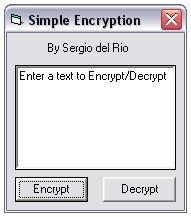



## \[A simple encryption\]

### Description

This is a siple encrypt/decrypt code. Please vote. :)
 
### More Info
 

             |
---                |---
**Submitted On**   |2003-08-12 00:30:38
**By**             |[Sergio del Rio](https://github.com/Planet-Source-Code/PSCIndex/blob/master/ByAuthor/sergio-del-rio.md)
**Level**          |Beginner
**User Rating**    |4.1 (58 globes from 14 users)
**Compatibility**  |VB 3\.0, VB 4\.0 \(16\-bit\), VB 4\.0 \(32\-bit\), VB 5\.0, VB 6\.0
**Category**       |[Encryption](https://github.com/Planet-Source-Code/PSCIndex/blob/master/ByCategory/encryption__1-48.md)
**World**          |[Visual Basic](https://github.com/Planet-Source-Code/PSCIndex/blob/master/ByWorld/visual-basic.md)
**Archive File**   |[\[A\_simple\_1628218122003\.zip](https://github.com/Planet-Source-Code/sergio-del-rio-a-simple-encryption__1-47632/archive/master.zip)

